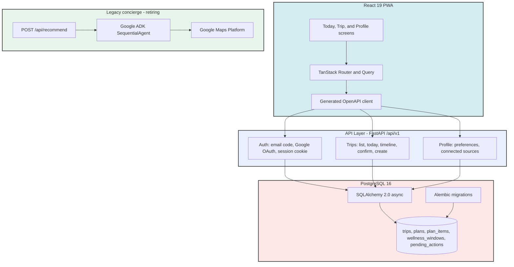

# TravelWell AI

### *Find Your Perfect Workout. Anywhere. Anytime.*

**Powered by Explainable Multi-Agent AI. Every recommendation explained.**

[](https://www.python.org/)
[](https://react.dev/)
[](https://www.postgresql.org/)
[](https://github.com/google/adk)
[](https://cloud.google.com/run)
[](https://cloud.google.com/vertex-ai)
[](https://developers.google.com/maps)
[](LICENSE)

---

## 🌟 Overview

TravelWell is a proactive travel wellness agent that activates around an upcoming trip, understands itinerary and calendar context, recommends wellness and dining options, takes approved actions such as reservations or calendar updates, and adapts when plans change.

Unlike traditional search, TravelWell uses an orchestrator engine to coordinate specialized agents, ensuring all decisions are policy-checked, audited, and explainable before being presented to the user.

### Key Highlights
*   **Trip-Centric Agent State:** Every plan, action, and event belongs to a trip rather than a chat session, so the agent's responsibility spans the whole away-period from home.
*   **Detect, Confirm, Prepare, Adapt:** Trips are proposed from calendar evidence with a confidence score, promoted by the user, planned close to departure, and replanned when the schedule changes.
*   **Explainable Recommendations:** Every option carries the preferences it matched, its distance and duration, and why the alternatives were rejected. The provenance is served from data, never re-generated by a model.
*   **Approval Before Side Effects:** Anything with a real-world effect, such as a reservation or a calendar write, flows through an explicit propose, approve, execute, verify pipeline.
*   **Contract-First:** `docs/openapi.yaml` is the only interface the frontend knows. The TypeScript client and every status enum are generated from it, and CI fails if they drift apart.

---

## ✨ Features

*   **✓ Today Screen:** The current day at a glance: the trip's state line, the day's wellness window with the commitments that bound it, and what is coming up next.
*   **✓ Trip Screen:** A day-by-day timeline interleaving calendar commitments with plan items, plus a day selector and the full trip list.
*   **✓ Trip Confirmation:** Detected trips show their evidence and confidence; nothing proceeds until the user promotes one.
*   **✓ Manual Trips:** Create a trip by hand when nothing was detected, with the same lifecycle as a detected one.
*   **✓ Ranked Options with Reasons:** Plan items carry a selected option plus alternatives and rejected candidates, each with its matched preferences, travel time, and rejection reason.
*   **✓ Profile & Preferences:** Dietary, activity, amenity, budget, and session-length preferences, plus autonomy toggles, stored as typed columns rather than free text.
*   **✓ Session Sign-In:** Email one-time code or Google OAuth, both terminating in a signed HttpOnly session cookie.
*   **✓ Legacy AI Concierge:** The original Google ADK gym-finder pipeline (Maps and Places integration, explainable validation, mock fallback) is still mounted at `POST /api/recommend` and retires as the v1 surface replaces it.

---

## 🏗️ Architecture



The contract lives in [docs/openapi.yaml](docs/openapi.yaml); the readable
schema reference is [docs/schema.sql](docs/schema.sql), with operational truth
in `backend/migrations/`. Both are kept honest by CI. See
[docs/ARCHITECTURE.md](docs/ARCHITECTURE.md) for the full picture.

---

## 🚀 Deployment & Installation

### Local Development

1.  **Clone the Repository:**
    ```bash
    git clone https://github.com/scrivner-solutions/travelwell-agent.git
    cd travelwell-agent
    ```

    Requires [uv](https://docs.astral.sh/uv/getting-started/installation/) for
    Python dependencies and Docker for the local Postgres.

2.  **Run the Backend (Python + Postgres):**
    ```bash
    cd backend
    cp .env.example .env               # APP_ENV=dev is required locally
    docker compose up -d               # Postgres 16 on localhost:5432
    uv run alembic upgrade head        # apply migrations
    uv run python scripts/seed.py      # demo user + trips (idempotent)
    uv run uvicorn app.fast_api_app:app --port 8000
    ```

    The session signing secret is resolved at startup: set `APP_ENV=dev` (which
    `.env.example` does) or a real `SESSION_SECRET`, or the app refuses to
    start. In dev mode, sign-in codes are printed to the server log.

3.  **Run the Frontend (React):**
    ```bash
    cd ../frontend
    npm install
    npm run dev                        # proxies /api to localhost:8000
    ```

    Configuration is runtime, not build time: `public/config.json` ships with an
    empty base URL, meaning same origin, which the dev proxy forwards to the
    local backend. There is no frontend `.env`.

    Sign in as `demo@travelwell.dev` and read the one-time code from the backend
    log.

### Cloud Run Deployment

The project is built to run containerized in Google Cloud:
*   **Backend:** Packaged via Docker and deployed to Cloud Run with environment variables for API keys and project settings.
*   **Frontend:** Built static and served via Nginx on Cloud Run.

### Environment Variables

Backend only; the frontend is configured at runtime. See
[backend/.env.example](backend/.env.example) for the fully annotated list.

*   `APP_ENV`: Set to `dev` for local development. Allows the insecure dev session secret and prints sign-in codes to the log. Never set outside local development.
*   `SESSION_SECRET`: Signing key for the session cookie. Required whenever `APP_ENV` is not `dev`.
*   `DATABASE_URL`: Postgres connection string; defaults to the compose credentials.
*   `GOOGLE_CLIENT_ID` / `GOOGLE_CLIENT_SECRET`: Google OAuth sign-in. Unset means that endpoint answers 503 and email-code sign-in still works.
*   `GOOGLE_MAPS_API_KEY`: API credential for Google Places, Routes, and Geocoding APIs (legacy concierge).
*   `GOOGLE_GENAI_USE_VERTEXAI`: Set to `true` to use Google Vertex AI model endpoints (legacy concierge).

---

## ✅ CI

Every pull request and every push outside `main` runs three jobs
([.github/workflows/ci.yml](.github/workflows/ci.yml)): frontend gates
(generated-client sync, typecheck, lint with import boundaries, unit tests,
build), schema drift checks (`docs/schema.sql` against the migration chain, and
the ORM models against the migrated database), and backend API integration
tests against a real Postgres.

---

## 📄 License

This project is licensed under the MIT License - see the [LICENSE](LICENSE) file for details.
