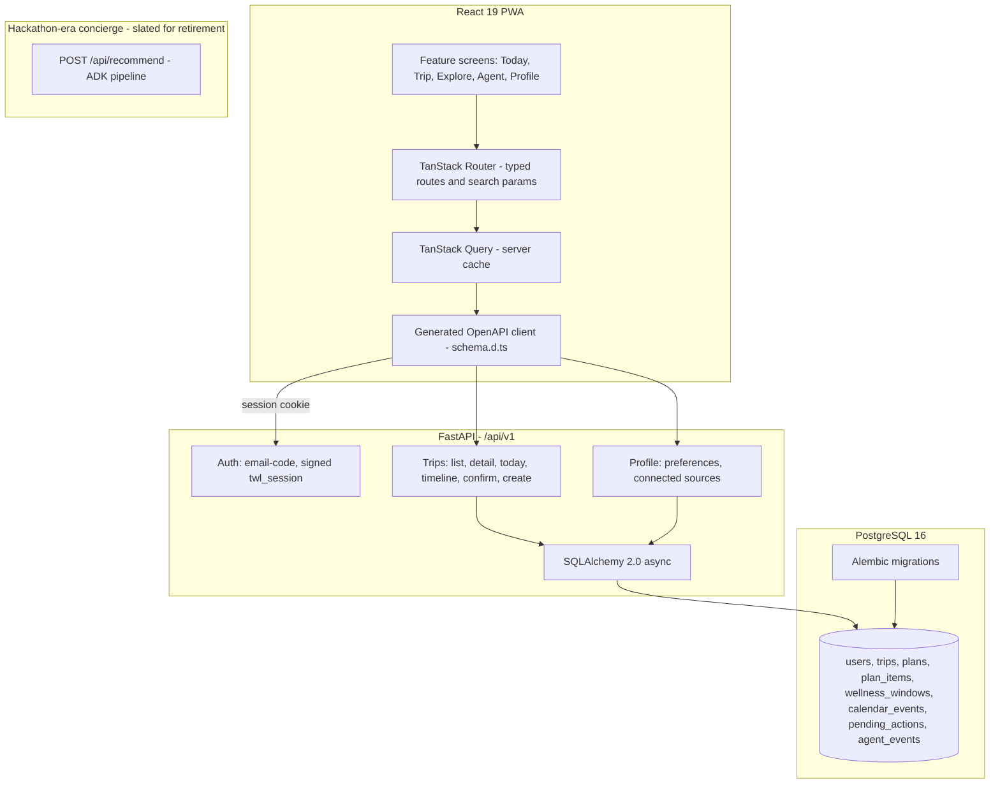
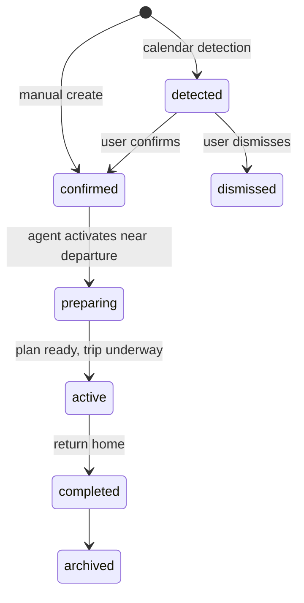

# TravelWell Architecture

TravelWell is a proactive travel wellness agent: a React PWA over a FastAPI
backend and PostgreSQL, with an agent layer that activates around trips. This
document describes the system as built; the API surface is defined in
[openapi.yaml](./openapi.yaml) and the data model in [schema.sql](./schema.sql)
and [ERD.md](./ERD.md).

---

## System shape



The legacy concierge endpoints (`/api/recommend`, `/resolve_location`,
`/api/config`) remain mounted for reference and retire as the v1 surface
replaces them.

## Contract-first workflow

`docs/openapi.yaml` is the single interface between frontend and backend:

1. The contract is edited first (endpoint shapes, enums, derived fields).
2. `npm run generate:api` regenerates the TypeScript client
   (`frontend/src/api/schema.d.ts`); status enums are never re-declared by
   hand.
3. Backend Pydantic schemas mirror the contract explicitly; derived fields
   (`destination_name`, `state_line`, `needs_you_count`) are computed
   server-side, never client-side.
4. CI regenerates the client and fails on drift.

The same discipline applies to the schema: `backend/migrations/` is
operational truth, `docs/schema.sql` the readable reference, and CI applies
both to scratch databases and diffs the results.

## API conventions

- **Auth**: email one-time code exchanges for a signed `twl_session` cookie
  (HttpOnly; no tokens in JavaScript). Google OAuth terminates in the same
  session mechanics.
- **Errors**: RFC 9457 `application/problem+json` with a stable machine
  `code` on every non-2xx, including validation errors.
- **Concurrency**: mutating requests carry the entity's `updated_at` as an
  optimistic-lock token; a mismatch is a 409 telling the client to refetch.
  Retries of an already-applied mutation get the success postcondition, not
  a conflict.
- **Idempotency**: action-creating POSTs require a client-generated
  `Idempotency-Key` UUID header.

## Trip lifecycle

The trip, not the chat session, owns agent state. A trip is one contiguous
period of displacement from home; every planning, action, and event row
carries `trip_id`.



Design rules the schema encodes:

- **Reasoning is separated from execution.** Recommendations live in
  `plan_items`/`plan_item_options` (ranked, with explanations and rejection
  reasons). Anything with a real-world side effect flows through
  `pending_actions` with an explicit propose, approve, execute, verify
  pipeline; user approval gates are data, not code paths.
- **Plans are versioned, never mutated in place.** A schedule change produces
  a superseding plan version, so "what changed and why" is always answerable.
- **Detection proposes, never assumes.** Detected trips carry evidence rows
  and a confidence score; only the user promotes them.
- **Privacy**: ingestion stores derived fields from calendar and email
  sources, not raw payloads.

## Frontend structure

Feature-first layout with lint-enforced boundaries (features never import
each other; UI primitives never import application layers; hex colors exist
only in the token layer):

```
frontend/src/
  routes/         thin URL layer: params, ?sheet= and ?trip= search params,
                  guards, code-split points
  features/       vertical slices: onboarding, today, trip, explore, profile
  components/ui/  primitives (Button, Card, Sheet, ...)
  api/            generated client + typed query options
  styles/         design tokens
  lib/            runtime config, date and trip helpers
```

Configuration is runtime, not build time: the container entrypoint writes
`/config.json` at start and the app reads it before mounting, so one image
serves every environment.

## Agent layer (in design)

The proactive layer (calendar ingestion, trip detection, planning runs on an
event spine, notifications) is designed but not yet implemented; the
database tables it will drive (`agent_events`, `agent_runs`,
`pending_actions`, `notifications`) ship with the schema above so the
reactive app is already built against the final shapes.
